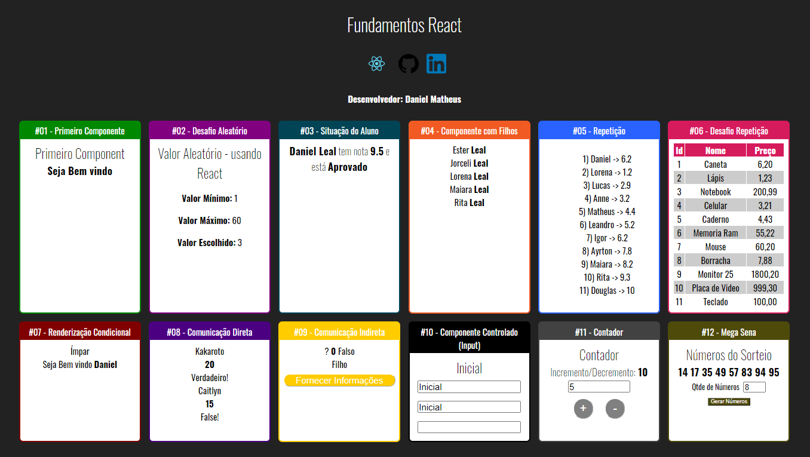

Neste repositório construí alguns exemplos com os fundamentos do reactJS para colocar em prática os conceitos.

## ScreenShot
<p align=center> 
  
</p>

## Como utilizar

- <h4><strong>Para executar o projeto:</strong></h4>

1. Abra o terminal e digite:</br>

```
git clone <url-repositório>
```

2. Entre na pasta do projeto via terminal e digite:

```
npm install  ou  yarn install

```

3. Por último, execute a linha abaixo no terminal: 

```
yarn start 
```

## :pencil: Autor
<table>
  <tr>
    <td align="center"><a href="https://github.com/danielLeal98"><br /><sub><b>Daniel Leal</b></sub></a><br /></td>
  <tr>
</table>
